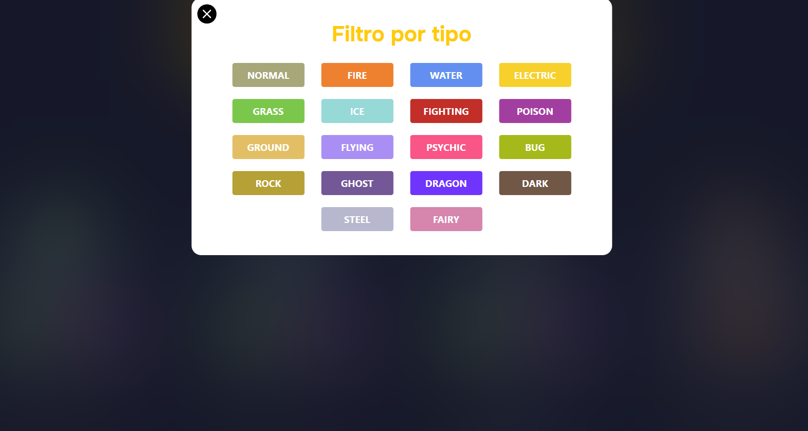
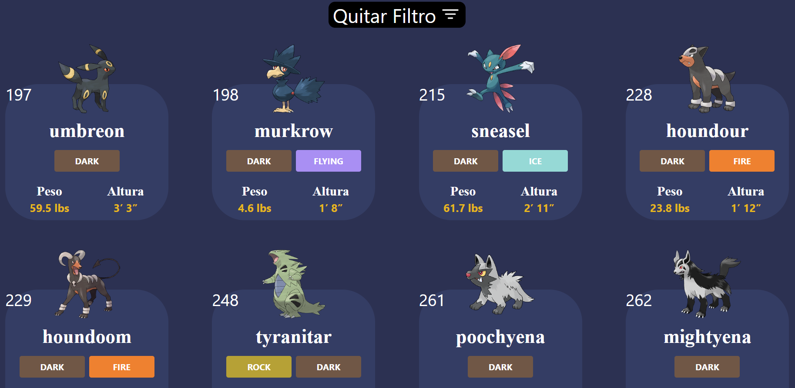

# 📖 Pokedex

Una Pokédex, que consume datos en tiempo real desde la **[PokeAPI](https://pokeapi.co/)**.  
El proyecto muestra información detallada de cada Pokémon, incluyendo:

- Número en la Pokédex
- Imagen oficial
- Tipo o tipos
- Peso (lbs)
- Altura (pies)

## 🚀 Características

- ⚡ **Datos en vivo** desde la PokeAPI.
- 📱 **Diseño responsivo**: optimizado para PC, tablets y móviles.
- 🔍 **Barra de búsqueda** para encontrar Pokémon por nombre.
- ⏩ **Paginación** para navegar entre diferentes Pokémon.
- 🎨 **UI personalizada** con estilo inspirado en Pokémon, usando TailwindCSS.

## 📸 Screenshots

### Pantalla principal

### Filtro por tipo de pokemon

### Búsqueda específica de pokemon

## ⚙️ Instalación

1. Clona este repositorio
2. Entra en la carpeta del proyecto
3. Instala la dependencias: **npm install**
4. Inicia el servidor de desarrollo: **npm run dev**

El sitio se abrirá en http://localhost:5173
(o el puerto que Vite te indique).

## 🛠️ Tecnologías utilizadas

- React
- Tailwind CSS

## 👨‍💻 Autor

Desarrollado por [mí](https://github.com/FerDeveloperJS).
